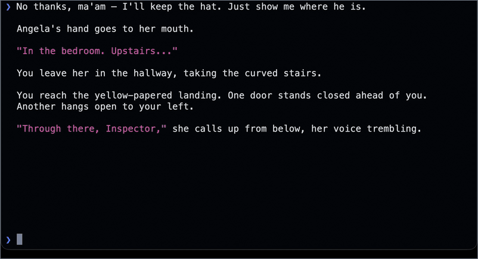
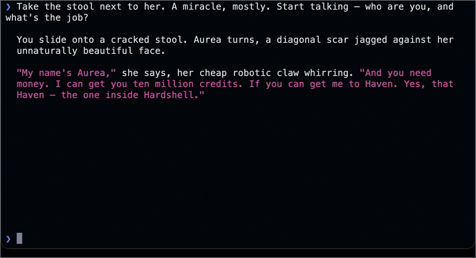

<p align="center">
  
</p>

# Ferrytale — Interactive Fiction AI "Interpreter"

[](https://discord.gg/QNDhbYWKr4)
[](LICENSE)

Play classic text adventures or text-based board games by saying or typing what you
want to do — no parser commands to memorize, no guess-the-verb. Ferrytale narrates
the story aloud like an audiobook, gives each character their own voice, and listens
for spoken input, so playing a decades-old game feels closer to being *inside* the
story — hopefully breathing life into a declining medium.

The quotation marks around "interpreter" are deliberate. A normal IF interpreter
runs an original story file — a `.gblorb`, `.zblorb`, `.ulx`, `.z5`, or `.z8`.
Ferrytale does not. Instead it reads a **complete transcript of a full playthrough**
(for example, a
[ClubFloyd transcript](https://allthingsjacq.com/interactive_fiction.html#clubfloyd))
and treats that transcript as canon. Gemini narrates on top of it — free to
embellish scene detail and character responses — but the transcript anchors the
real plot points, puzzles, and pacing. You are discovering a story a human author
actually wrote, not one an AI is inventing as you go. That being said, Ferrytale
does not necessarily know every branch, failure state, or alternate solution the
original supports. It helps that most classic IF is old enough for its walkthroughs
and discussion to be well represented in model training, which fills many of the
gaps.

For now, Ferrytale has only been tested on a high-end Mac — see
[Tested configuration](#tested-configuration) for the exact machine and versions.

### See it in action

<table align="center">
  <tr>
    <td align="center">
      <a href="assets/demo.mp4"></a>
    </td>
  </tr>
  <tr>
    <td align="center">
      <sub><em>Ferrytale playing <a href="https://ifdb.org/viewgame?id=jdrbw1htq4ah8q57">Make It Good</a> by Jon Ingold — a washed-up inspector, a body upstairs, and every character in their own AI-designed voice. Silent excerpt — <strong><a href="assets/demo.mp4">watch with sound</a></strong> · re-create via <a href="scripts/demo/README.md">scripts/demo/</a></em></sub>
    </td>
  </tr>
</table>

<table align="center">
  <tr>
    <td align="center">
      <a href="assets/demo-superluminal.mp4"></a>
    </td>
  </tr>
  <tr>
    <td align="center">
      <sub><em>Ferrytale playing <a href="https://ifdb.org/viewgame?id=5xzoz5wimz4xxha">Superluminal Vagrant Twin</a> by C.E.J. Pacian — a broke space captain, a ten-million-cred job, and the ship's engineer crackling in over the comms, each voice in its own color. Silent excerpt — <strong><a href="assets/demo-superluminal.mp4">watch with sound</a></strong></em></sub>
    </td>
  </tr>
</table>

### Features

- **Natural language, not parser syntax.** Describe your intent; the model maps it
  onto the current scene.
- **Transcript-grounded canon.** Major beats come from a real human playthrough,
  not AI invention.
- **Voice in, voice out.** Optional spoken input and audiobook-style narration for
  hands-free play.
- **Distinct character voices.** OmniVoice plus ElevenLabs Voice Design give each
  speaker their own voice.

## Quick start

Grab a free **Gemini** API key from
[Google AI Studio](https://aistudio.google.com/apikey) (and, for generated
character voices, an **ElevenLabs** key from the
[API keys dashboard](https://elevenlabs.io/app/developers/api-keys)). Then:

```sh
git clone https://github.com/akeybl/ferrytale.git
cd ferrytale
cp .env.example .env
$EDITOR .env          # paste your GEMINI_API_KEY
./play anchorhead     # or: ./play games   to browse the catalog
```

That is the whole setup. The first run creates `.venv`, installs what it needs,
downloads the transcript, and starts playing — on macOS it even installs the voice
toolchain for you (Homebrew, Apple's Command Line Tools, portaudio, ffmpeg) and may
ask for your password.

**Want a lighter first run?** Add `--no-voice` (`./play --no-voice anchorhead`) to
play by typing — it installs only a small text runtime and starts in seconds. The
full voice experience downloads ~2 GB and compiles whisper.cpp the first time.

Ferrytale needs **Python 3.12** (the voice stack pins it); if you don't have it, the
bootstrap tells you how to get it. See [Setup reference](#setup-reference) for the
details.

### Tips for playing

A few things that are not obvious coming from a traditional parser:

- **You do not need save files to skip around.** Just ask to jump to another day,
  location, or part of the story.
- **When you are stuck, ask in-world.** Question another character for guidance, or
  have your own character stop and think through the situation.
- **The narrator only answers your character.** It responds to the dialogue and
  actions you put in as your character — never to you directly, out of character.
- **Interrupt at any moment.** You never have to wait for a line to finish — speak
  or type at any time to cut off the narration or a character mid-sentence, and
  your input is taken as a redirect from exactly where it was cut off.
- **Play on your commute.** Hands-free over your car's Bluetooth, listening and
  responding as you drive, is hugely immersive — and a lot of fun.
- **Find good games with IFDB.** The [Interactive Fiction Database](https://ifdb.org)
  has community ratings and reviews — a great way to pick what to play from the
  catalog (`./play games`) or to find a game worth bringing your own transcript for.

### Where the games come from

The built-in catalog draws on
[ClubFloyd transcripts](https://allthingsjacq.com/interactive_fiction.html#clubfloyd) —
community playthroughs of a wide range of IF, **652 games** in all. Starting a
game downloads only that game's transcript; nothing else is committed to the repo.

**Please support the authors.** These are real games by real people, and Ferrytale is
a way to *experience* their work, not a substitute for it. If a game you play here
can be bought, or its author accepts tips or donations, please support them —
ideally before you play through it. Many classic IF games are free, but supporting
the people who made them is what keeps the medium alive. For example, *Anchorhead* — the game used in
the Quick Start above — can be bought on
[Steam](https://store.steampowered.com/app/726870/Anchorhead/).

You can also bring your own material. Any narrative game works if you supply an
OCR'd or transcribed Markdown-style transcript as `transcripts/<slug>.txt`.
Ferrytale never fetches transcripts from non-ClubFloyd sources on its own.

**Mysteries are an especially good fit** — questioning suspects, chasing leads, and
assembling story state all map naturally onto the interaction model. Two worth
highlighting:

- [Sherlock Holmes Consulting Detective](https://www.spacecowboys-games.com/universe/sherlockholmesconsultingdetective/)
  from Space Cowboys — a standalone box runs about `$59.99` via
  [Asmodee USA](https://store.asmodee.com/products/sherlock-holmes-the-thames-murders-and-other-cases),
  depending on edition and retailer.
- [A Speakeasy Murder](https://www.freeformgames.com/product/a-speakeasy-murder/)
  from Freeform Games — listed around `£41.99`.

Prices drift; treat them as ballpark figures.

## Choosing a mode

Every mode accepts typed input — the differences are all in voice:

| Command | What you get | Requires |
| --- | --- | --- |
| `./play --no-voice anchorhead` | Gemini only — type and press Enter | `GEMINI_API_KEY` |
| `./play --kokoro anchorhead` | Spoken input + Kokoro narration | `GEMINI_API_KEY`, local audio, whisper.cpp |
| `IF_ENGINE_OMNIVOICE_CHARACTER_VOICES=0 ./play anchorhead` | Spoken input + OmniVoice narration (no character voices) | `GEMINI_API_KEY`, local audio, whisper.cpp |
| `./play anchorhead` (with `ELEVENLABS_API_KEY`) | OmniVoice narration + generated character voices | Gemini + ElevenLabs for first-time voice design |

On a lower-spec machine, **Kokoro** is the lighter choice: it is CPU-friendlier and
skips loading the OmniVoice model.

## Playing

```sh
./play                          # resume your most recent session
./play anchorhead               # match by title, author, or slug
./play --new anchorhead         # start a fresh playthrough
./play --new --fast-mode anchorhead
./play games anchor             # browse the catalog, optionally filtered
./play sessions                 # list saved sessions
./play --no-voice anchorhead
```

Ferrytale keeps **one canonical playthrough per game**. The first `./play <game>`
starts it; later runs resume it. Use `--new` for a clean restart.

Under the hood, `play` wraps a lower-level engine, `ferrytale.py`, which you can call
directly:

```sh
.venv/bin/python ferrytale.py --new --game anchorhead
.venv/bin/python ferrytale.py --list
.venv/bin/python ferrytale.py --list-games
```

### Commands during play

- `/cost` — full cost breakdown and current context size
- `/quit`, `/exit`, `/q`, or `Ctrl-C` — save and leave

### Useful flags

- `--game <slug>` — catalog slug (required for new sessions)
- `--new` — start a fresh session
- `--show-costs` — print per-turn token/cost lines
- `--fast-mode` — Gemini priority service tier, ~1s lower latency
- `--no-voice` — disable voice mode
- `--wake-word` — enable the `Okay` wake word
- `--car-mode` — car/Bluetooth wake-word defaults
- `--compact-at N` — override the compaction threshold in tokens (for testing)

## How it works

At its core, Ferrytale swaps the rigid parser for a language model while keeping the
game world intact. You type or speak what you want to do, say, ask, inspect, or
think about, and the model maps that intent back onto the transcript-grounded
situation. Verb discovery stops being about guessing the original command and
becomes about staying in the scene.

While the narrator is speaking, your input line stays live. Press Enter to
interrupt — your text is sent as a clarification or redirect from the exact point
the narration was cut off.

### The transcript library

The tracked catalog lives in `catalog/clubfloyd.json`: titles, authors, dates, and
source URLs for every ClubFloyd game, without committing the transcripts
themselves. Downloaded transcripts land in `transcripts/` — one `<game>.txt` per
game, plus an `index.json` of downloaded title, author, and source metadata.

`./play games` reads the tracked catalog. Starting a game pulls down only that
game's transcript if it is missing. To prefetch one by hand:

```sh
.venv/bin/python build_transcripts.py --game anchorhead
```

The catalog's source links point at [Web Archive](https://web.archive.org)
(Wayback Machine) snapshots of the
[ClubFloyd transcripts](https://allthingsjacq.com/interactive_fiction.html#clubfloyd),
so fetching a transcript pulls from the archive and adds no load to the
volunteer-run allthingsjacq.com server. Generated transcripts and raw downloads are
treated as local cache and gitignored.
To rebuild the whole local cache:

```sh
.venv/bin/python build_transcripts.py --all
```

You can always drop in your own transcript at `transcripts/<slug>.txt`; Ferrytale
will not fetch from non-ClubFloyd sources automatically.

Each transcript is plain text — an opening passage, `> command` lines, and the
output text after each command. For a new playthrough, the opening page is
generated from real story content in the transcript; title screens, copyright and
version banners, help text, and other non-story chrome are stripped out.

**Normalizing ClubFloyd logs.** Because ClubFloyd transcripts are multiplayer chat
logs, the importer cleans them up by:

- using only the game-session column
- dropping `Floyd ]` status lines and keeping the text from `Floyd | ...` output
- converting `<player> says (to Floyd), "x me"` into `> x me`
- removing the initial `load` command
- dropping chat banter and removing duplicate command/output pairs
- treating everything before the first real command as the opening page
- handling the newer `CF` and `ClubFloyd` bot names

### Sessions and context

Sessions are append-only JSONL files in `sessions/`, each bound to its game by the
first `meta` event. Resuming replays the previous playthrough before continuing,
and compaction never erases that replay data.

Context is assembled in a fixed order: system prompt, transcript, opening page, an
optional session summary, then play turns. The current model defaults:

- **Model:** `gemini-flash-latest`
- **Thinking level:** `high`
- **Optional service tier:** `priority` (via `--fast-mode`)

### Hidden and structural tags

The narrator uses a few invisible tags to manage the experience. All of them stay
in the model's context but are stripped from what you see and hear:

- **`<hidden>...</hidden>`** holds secrets or foreshadowing — kept in context,
  never shown or spoken.
- **`<location/>`** marks a scene change. Rather than print a new room title (which
  reads like parser chrome and breaks the audiobook spell), the engine collapses
  one or more of these tags and the surrounding whitespace into a single paragraph
  break. If a tag arrives mid-sentence during streaming, the break is moved back to
  the start of that sentence so the visible prose does not split awkwardly.
- **`<progress/>`** flags newly revealed story progress, outside hidden spans. If
  two narrator pages in a row omit it, the engine nudges the model to move the
  player toward a clue, event, obstacle, consequence, or character response.

### Compaction

To keep context from growing without bound, compaction triggers **150,000 tokens
past** the immutable base (system prompt plus transcript message). When it runs,
play pauses, the model writes a structured storyline summary, and that summary
replaces the old turn history in active context. The session log stays
append-only, and the compaction call is costed like any other turn.

## Voice and immersion

Voice is what sets Ferrytale apart, and it is on by default in a live terminal. Turn
it off with `--no-voice` — the launcher then installs no voice dependencies and the
session header tells you to type and press Enter.

### Voice input

By default, input is **push-to-talk**: hold Shift while you speak. With
`--wake-word` or `--car-mode`, the engine instead waits for the wake word `Okay`
(and Shift still works as manual push-to-talk). In either mode, Caps Lock toggles
an open mic until you turn it off.

The mic runs at 16 kHz through a short pipeline:

1. WebRTC AEC cancels the narrator's echo.
2. Silero VAD detects when you are actually speaking.
3. whisper.cpp transcribes the accepted turns.
4. A short proper-noun prompt, built from the loaded transcript, aids recognition.

If a real transcription comes through, playback stops and your words are submitted
as player input. Empty or noise-only transcriptions simply resume playback.

### Audiobook output

**OmniVoice** is the default TTS engine. It synthesizes in a way that minimizes the
wait before you hear anything:

1. the first sentence immediately,
2. then the rest of that paragraph,
3. then later paragraphs one at a time.

**Kokoro** is the lighter alternative, working in sentence-sized chunks:

```sh
./play --kokoro anchorhead
```

(`--omnivoice` switches back to the default engine if you have set
`IF_ENGINE_TTS_ENGINE` in `.env`.)

`IF_ENGINE_KOKORO_VOICE` picks the Kokoro voice *name* (default `bm_george`) — it
does not turn voice on or off, so use `--no-voice` to disable voice. (The older
`IF_ENGINE_VOICE` still works as an alias.) Audio devices are selected with
`IF_ENGINE_VOICE_INPUT_DEVICE` and `IF_ENGINE_VOICE_OUTPUT_DEVICE`.

**Changing the narrator voice.** Override it the same way as the audio cues —
point `IF_ENGINE_NARRATOR_VOICE` at a short authorized WAV (or just replace
`assets/voice-clone-reference.wav`), and the default **OmniVoice** engine clones
that voice. Prefer a text description? Set `IF_ENGINE_OMNIVOICE_INSTRUCT` (for
example, `female, warm, mid-pitch, american accent`). With **Kokoro**, set
`IF_ENGINE_KOKORO_VOICE` to a Kokoro voice name. See
[Advanced voice settings](#advanced-voice-settings) for the rest.

Each chunk of text appears on screen as its audio begins playing. (Resumed sessions
replay text only — they are not re-spoken.) With OmniVoice, every synthesized chunk
is aligned with whisper.cpp afterward, so text surfaces sentence by sentence exactly
as playback reaches the first word of each sentence — even when the audio was
generated in larger pieces. Audio cues like `[sigh]`
and `[laughter]` are spoken only; they are stripped from display and replay text.

### Character voices

When OmniVoice is active, the model wraps every span of spoken dialogue, by any
speaker, in a named voice tag:

```text
"<voice name="Michael">Hi, honey. I was just about to come looking for you.</voice>"
"<voice name="real estate agent">The keys should be ready at the office.</voice>"
```

The `name` is required and doubles as the cache key — a proper character name, or a
stable descriptive role name for unnamed speakers (`hotel bellboy`, `hotel
manager`, `day clerk`, `room constable`, `cab driver`, and so on), with local
context added only when two speakers would otherwise collide. The visible quotation
marks stay; the tag sits inside them. Narration, action text, attributions like "he
said" or "she replied," hidden text, and location and progress tags are never
wrapped. Do not add a `prompt` attribute — a separate Gemini voice-design pass
receives the full transcript and writes the voice prompts itself. The tags are
stripped from display and replay text.

The first time an uncached character speaks, the engine:

1. asks Gemini to write both an ElevenLabs Voice Design description and a supported
   OmniVoice `instruct` string, using the full transcript, the character's name,
   and any existing cached voices;
2. calls ElevenLabs `POST /v1/text-to-voice/design`;
3. scores the returned previews and keeps the widest/best one;
4. saves that preview MP3 and its metadata;
5. builds an OmniVoice clone prompt from the preview when the character first
   speaks, then synthesizes the line with the cached, character-specific OmniVoice
   `instruct`.

This is the one place ElevenLabs is involved. Character voices are generated **on
demand** through Voice Design, so first-time generation needs `ELEVENLABS_API_KEY`
in `.env` or the environment. A Starter subscription (`$6/mo`) or higher covers
character-voice creation through the Voice Design API. Once cached, a voice never
calls ElevenLabs again — reuse adds no cost. Set
`IF_ENGINE_OMNIVOICE_CHARACTER_VOICES=0` for OmniVoice narration without character
voices.

**Why ElevenLabs only seeds the cache:** its TTS quality is markedly better, but
per-line synthesis would be too expensive for live play. So Ferrytale uses local
OmniVoice for all runtime audio and reserves ElevenLabs for the one-time Voice
Design preview that seeds each cached character voice.

**Caching.** Voices live under:

```text
.cache/elevenlabs-voices/<transcript-stem>/<normalized-character-name>/
```

The cache is gitignored. To share a game's voices and skip first-time design calls
on another machine, copy that game's directory — for example
`.cache/elevenlabs-voices/anchorhead/` — to the same path on the other machine. Or
place shared caches anywhere and point to them:

```text
IF_ENGINE_ELEVENLABS_VOICE_CACHE_DIR=/path/to/shared/elevenlabs-voices
```

Identity is the transcript stem plus the character name: if `voice.json` and
`preview.mp3` exist for a character, gameplay reuses them across sessions and never
calls ElevenLabs for that character.

**Terminal colors.** System messages and the input chevron `❯` render in blue.
Each character voice also gets its own hex display color, chosen at voice-design
time to stay clearly distinct from the system blue and from every other cached
voice (stored as `display_color` in `voice.json`; voices cached before colors
existed get a stable name-derived color). A character's dialogue — including the
quotation marks around it — renders in their color during live narration and in
session replays. Narration and player input stay uncolored, and plain (piped)
output carries no color codes.

**Pre-generating voices.** To create voices before you play:

```sh
.venv/bin/python scripts/pregenerate_character_voices.py anchorhead
```

By default it asks Gemini to identify the distinct dialogue speakers in the
transcript, then creates missing voices one at a time. To skip discovery and
generate a known set:

```sh
.venv/bin/python scripts/pregenerate_character_voices.py anchorhead \
  --character "Michael" --character "real estate agent"
```

Or preview without creating anything:

```sh
.venv/bin/python scripts/pregenerate_character_voices.py anchorhead --dry-run
```

Cached voices are surfaced to the model inside the OmniVoice system prompt:

```text
<voice name="Michael">generated ElevenLabs voice description</voice>
```

If voice design fails, or `ELEVENLABS_API_KEY` is missing, that one utterance falls
back to the global OmniVoice instruction instead of crashing.

### Advanced voice settings

**OmniVoice defaults:**

```text
IF_ENGINE_OMNIVOICE_DEVICE=auto
IF_ENGINE_OMNIVOICE_DTYPE=float16
IF_ENGINE_OMNIVOICE_NUM_STEP=32
IF_ENGINE_OMNIVOICE_SPEED=0.9
IF_ENGINE_OMNIVOICE_INSTRUCT="male, low pitch, elderly, british accent"
```

Voice cloning uses these local narration reference files by default:

```text
assets/voice-clone-reference.wav
assets/voice-clone-reference.txt
```

Character dialogue tagged with `<voice name="...">` clones from that character's
cached ElevenLabs preview MP3 and uses the cached, transcript-derived OmniVoice
`instruct`.

To override narration with your own authorized short clip:

```text
IF_ENGINE_OMNIVOICE_CLONE_REFERENCE=/path/to/reference.wav
```

WAV is preferred over MP3. You can pass optional transcript text with
`IF_ENGINE_OMNIVOICE_CLONE_TRANSCRIPT`. The full set of clone and character-voice
overrides:

- `IF_ENGINE_OMNIVOICE_CLONE_REFERENCE`
- `IF_ENGINE_OMNIVOICE_CLONE_TRANSCRIPT`
- `IF_ENGINE_OMNIVOICE_CLONE_TRANSCRIPT_PATH`
- `IF_ENGINE_OMNIVOICE_WHISPER_CLONE_REFERENCE`
- `IF_ENGINE_OMNIVOICE_WHISPER_CLONE_TRANSCRIPT`
- `IF_ENGINE_OMNIVOICE_WHISPER_CLONE_TRANSCRIPT_PATH`
- `IF_ENGINE_OMNIVOICE_CHARACTER_VOICES`
- `IF_ENGINE_ELEVENLABS_VOICE_CACHE_DIR`

Set `IF_ENGINE_OMNIVOICE_CLONE_REFERENCE=` (empty) to force design-prompt mode even
when a reference file exists. Set `IF_ENGINE_OMNIVOICE_WHISPER_CLONE_REFERENCE=`
(empty) to disable the separate whisper clone and use design-mode whisper for
whispered chunks.

**Whispered delivery.** OmniVoice whisper tags are off by default. Enable them when
you want the model to request a whisper:

```sh
./play --whisper-tags anchorhead
```

With them on, the model may wrap visible narration or dialogue in
`<whisper>...</whisper>`. The tags are stripped from display and replay text; if
they appear while the feature is off, they are still stripped but spoken in the
normal voice. A whisper span can cover part of a sentence or several sentences —
only the text between the opening and closing tag is whispered.

The TTS chunker preserves whisper ranges across sentence and paragraph boundaries.
A tagged span appends `whisper` to whatever OmniVoice instruction is active (the
character-specific one inside a named voice, otherwise the global one), so the
default narration instruction becomes:

```text
male, low pitch, elderly, british accent, whisper
```

Whisper-tagged chunks fall back to voice-design mode with `, whisper` unless you
configure a whisper clone reference — normal clone prompts tend to overpower
OmniVoice's whisper style, and this keeps the delivery reliable.

Whisper controls:

- `--whisper-tags` / `--no-whisper-tags` — enable or disable `<whisper>` style tags
  (off by default)
- `IF_ENGINE_OMNIVOICE_WHISPER_TAGS=1`

These prompts are only added when OmniVoice is the active TTS engine.

**Proper-noun recognition.** For each game, the engine builds a short whisper.cpp
prompt from the title and loaded transcript to improve recognition of game-specific
names, without changing your submitted text:

- extract candidate people, places, organizations, works, products, and events
- use spaCy NER (`en_core_web_sm`, installed with the voice dependencies), falling
  back to a built-in capitalization-based extractor if it is unavailable
- filter likely false positives (sentence-start words, months, stopwords, all-caps
  status labels)
- rank by frequency, preserving first-seen order as a tiebreaker
- keep up to eighty terms and nine hundred characters
- cache the final prompt in `.cache/whisper-prompts/`

**Barge-in and AEC.** During playback, your speech must clear a post-AEC RMS gate
before it can pause the narrator. Defaults:

```text
IF_ENGINE_BARGE_IGNORE_MS=450
IF_ENGINE_BARGE_MIN_RMS=0.006
IF_ENGINE_BARGE_FRAMES=1
IF_ENGINE_BARGE_RMS_MULTIPLIER=2.4
```

Useful AEC knobs:

```text
IF_ENGINE_AEC_DELAY_MS=80
IF_ENGINE_AEC_REFERENCE_DELAY_MS=0
```

**Wake word.** The bundled wake word is `Okay` (`models/wake-word/okay.onnx`).

```sh
./play --wake-word anchorhead    # enable wake word for normal use
./play --car-mode anchorhead     # enable car/Bluetooth mode
```

Car mode turns the wake word on automatically and lowers the default threshold to
`0.4` for noisier Bluetooth captures, adding realtime high-pass, pre-emphasis, and
AGC to wake scoring. Say `Okay ...` by default, hold Shift for manual push-to-talk,
or use Caps Lock for open mic.

Wake-word controls:

- `--wake-word` — enable wake-word mode
- `--car-mode` — enable car/Bluetooth mode (threshold `0.4`, wake word on,
  high-pass + pre-emphasis + AGC)
- `--wake-word-model PATH` — use a specific openWakeWord model (repeat for multiple)
- `--wake-word-threshold N` — override the wake-word confidence threshold
- `--wake-word-preprocess` — force wake preprocessing
- `IF_ENGINE_WAKE_WORD=1` — env default for wake-word mode (off by default; `=0`
  disables it even in car mode)
- `IF_ENGINE_CAR_MODE=1` — env default for car/Bluetooth mode (threshold `0.4`,
  wake word on, high-pass + pre-emphasis + AGC)
- `IF_ENGINE_WAKE_WORD_MODEL`
- `IF_ENGINE_WAKE_WORD_THRESHOLD` — `0.9` by default, `0.4` in car mode
- `IF_ENGINE_CAR_WAKE_WORD_THRESHOLD=0.4` — car-mode default threshold
- `IF_ENGINE_WAKE_WORD_PREPROCESS=1` — force wake preprocessing without car mode
- `IF_ENGINE_WAKE_WORD_LOG_MIN_SCORE=0.35`
- `IF_ENGINE_WAKE_WORD_PATIENCE=1`
- `IF_ENGINE_WAKE_WORD_DEBOUNCE_SECONDS=1.0`
- `IF_ENGINE_WAKE_WORD_WINDOW_SECONDS=5.0`

**Overriding the bundled audio.** Three sounds ship in `assets/`. Override any of
them the same way — set its env var to your own file, or just replace the file in
`assets/`:

- `assets/confirm-cue.wav` — input accepted, or a startup model request —
  `IF_ENGINE_CONFIRM_CUE`
- `assets/turn-cue.wav` — narration finished, your turn — `IF_ENGINE_TURN_CUE`
- `assets/voice-clone-reference.wav` — the narrator's voice, which OmniVoice clones
  — `IF_ENGINE_NARRATOR_VOICE`

## Setup reference

`./play` bootstraps the local runtime before starting the engine: it creates
`.venv`, installs the pinned dependencies from `requirements.txt`, uses the tracked
ClubFloyd catalog, then runs. The selected transcript downloads into `transcripts/`
on demand if it is missing. `--no-voice` installs only the base Gemini runtime;
otherwise, since voice is on by default, the launcher reads `IF_ENGINE_TTS_ENGINE`
from the environment or `.env` and installs only the matching TTS package.

Kokoro and OmniVoice share the microphone, AEC, wake-word, and whisper.cpp
dependencies in `requirements-voice-common.txt`. The TTS-specific files are
`requirements-voice-kokoro.txt` and `requirements-voice-omnivoice.txt`. The
bootstrap also checks the required system audio/build tools and prepares a
repo-local whisper.cpp checkout in `.cache/whisper.cpp/`.

To prepare the runtime without launching a game:

```sh
scripts/install --base
scripts/install --voice
IF_ENGINE_TTS_ENGINE=kokoro scripts/install --voice
```

A few environment switches for setup:

- `IF_ENGINE_SKIP_BOOTSTRAP=1` — bypass the launcher bootstrap once you have
  prepared the environment yourself
- `IF_ENGINE_SKIP_TRANSCRIPT_DOWNLOADS=1` — fail instead of downloading a missing
  ClubFloyd transcript
- `IF_ENGINE_PYTHON` — point at Python 3.12 if it is not on `PATH`

**Python 3.12** is required and is the only tested version — the voice stack pins it
(torch 2.4.0 and Kokoro ship no wheels for 3.13+). If you don't have it, the
bootstrap prints how to get it; the usual options are `brew install python@3.12`
(macOS) or `pyenv install 3.12`, then re-run — or set `IF_ENGINE_PYTHON` to point at
an existing 3.12.

### API keys

**Gemini** is read from `GEMINI_API_KEY`. Gemini Flash is the default because it
strikes the best balance of latency and cost for transcript-grounded play. Create
a key in [Google AI Studio](https://aistudio.google.com/apikey), then:

```sh
cp .env.example .env
$EDITOR .env
```

`.env` is gitignored; `.env.example` is the committed template. There is no
fallback API key baked into the code.

**ElevenLabs** is read from `ELEVENLABS_API_KEY` — recommended for the default
character-voice experience and required for first-time Voice Design calls. Create
one in the [API keys dashboard](https://elevenlabs.io/app/developers/api-keys) and
add it:

```sh
ELEVENLABS_API_KEY=your_key_here
```

### whisper.cpp

Voice mode uses the bootstrap-managed whisper.cpp checkout by default. To use your
own, set `IF_ENGINE_WHISPER_DIR` to a checkout that has:

- a built `whisper-cli`
- `models/ggml-large-v3-turbo-q5_0.bin`
- `models/ggml-silero-v6.2.0.bin`

Or set the pieces individually:

- `IF_ENGINE_WHISPER_CLI`
- `IF_ENGINE_WHISPER_MODEL`
- `IF_ENGINE_WHISPER_VAD_MODEL`

If all three individual paths are set, `scripts/install --voice` verifies them and
skips cloning or downloading whisper.cpp assets.

> **Stuck?** The project is intentionally plain Python and Bash, so a coding agent
> can usually inspect the current machine state and patch the local setup. Point
> Codex or Claude Code at the repo and the failing command.

## Diagnostics, cost, and compatibility

### Diagnostics and tests

Offline checks cover chunking, Kokoro synthesis, the whisper round trip, AEC, and
synthetic VAD — without opening real audio devices:

```sh
.venv/bin/python diagnostics/voice_selftest.py
```

Live voice checks:

```sh
.venv/bin/python diagnostics/voice_livetest.py
.venv/bin/python diagnostics/voice_diagnose.py --dry-run --list-devices
.venv/bin/python diagnostics/voice_diagnose.py --save-prefix /tmp/if-engine-car
```

`voice_diagnose.py` runs silence and playback phases, then reports raw, post-AEC,
and preprocessed wake-word scores. Use `--wake-model PATH` to compare a candidate
wake model without changing your game configuration.

Cheap engine checks — piped input runs without the live interrupt UI or voice:

```sh
printf 'look around\n/quit\n' | .venv/bin/python ferrytale.py --new --game anchorhead --no-voice
.venv/bin/python ferrytale.py --compact-at 1000 --new --game anchorhead --no-voice
```

To print the effective configuration — engine, TTS, compaction threshold, and any
`IF_ENGINE_*` overrides currently in effect — without starting a game:

```sh
.venv/bin/python ferrytale.py --show-config   # or: ./play --show-config
```

### Cost

The engine records cost per model call and per external voice-design call using the
constants in `ferrytale.py`. `/cost`, `/exit`, `/quit`, `/q`, and `Ctrl-C` all print a
breakdown for the whole saved session; resumed sessions also show the current run
separately.

Current local rates for `gemini-flash-latest`:

- fresh input: `$1.50` per 1M tokens
- cached input: `$0.15` per 1M tokens
- output plus thinking tokens: `$9.00` per 1M tokens

```text
fresh_input = prompt_tokens - cached_input_tokens
cost =
  fresh_input          * 1.50 / 1_000_000
  + cached_input_tokens * 0.15 / 1_000_000
  + (output_tokens + thinking_tokens) * 9.00 / 1_000_000
```

ElevenLabs Voice Design cost is recorded whenever an uncached OmniVoice character
voice is created. The engine records the actual billed credits from the
ElevenLabs `character-cost` response header (falling back to the preview text
length) and estimates dollars via
`IF_ENGINE_ELEVENLABS_VOICE_DESIGN_PRICE_PER_1K_CHARS` (default `$0.10` per 1K
credits). ElevenLabs charges Voice Design once for the preview text even though
it returns three previews, and this project uses a fixed 101-character preview
sentence — so a newly generated character voice runs about `$0.0101`, plus the
Gemini character-description call.

**What actually drives cost:**

- The transcript is usually the largest input block.
- Gemini implicit caching makes repeated transcript/context input much cheaper once
  the cache is warm. The engine keeps the system prompt and transcript prefix
  byte-stable between turns so those hits actually land; cached tokens are read
  from each response's usage metadata and billed at the cached rate. (Implicit
  caching needs a ≥4,096-token prefix on Flash, so very small test transcripts
  may never show cache hits.)
- Output and thinking tokens are comparatively expensive.
- Compaction is an extra model call, but it prevents unbounded context growth.
- First-time OmniVoice character voices add one Gemini description call and one
  ElevenLabs Voice Design call per character name per transcript cache.
- `--fast-mode` only changes the latency tier — the local accounting uses the same
  token rates either way.

Measured costs for *Anchorhead* (the Quick Start game, ~120k-token transcript),
taken from real API responses on 2026-07-03 via `scripts/cost_report.py`:

| Event | Measured cost |
| --- | ---: |
| Opening page (new game, cold cache) | `$0.22` |
| Player turn (warm cache — ~94% of input billed at the cached rate) | `$0.03` |
| Player turn after a long break (cold cache) | `≈ opening page` |
| Compaction (summarizes the full context, mostly cached) | `$0.05` |
| Character discovery (pregeneration script only) | `$0.20` |
| New character voice — Gemini description | `$0.04` warm / `≈$0.20` cold |
| New character voice — ElevenLabs Voice Design (101 credits) | `~$0.0101` |
| Reusing a cached character voice | `$0.00` |

Costs scale roughly with transcript size — a 30k-token game runs about a quarter
of these numbers. The voice-description "warm" figure applies when another
transcript-prefixed voice call ran within the implicit-cache window (as in
pregeneration, which is why pregenerating voices is the cheap way to create
them); a voice designed mid-play usually pays the cold rate for its description
call. To re-measure on any game (this spends real API money — the full
Anchorhead report costs about `$0.63`):

```sh
.venv/bin/python scripts/cost_report.py anchorhead
.venv/bin/python scripts/cost_report.py <game> --turns 1 --skip-voices   # cheaper
```

The script drives the real engine code paths against a throwaway session and a
temporary voice cache, and prints a markdown table of per-event token usage and
cost.

Turns are cheapest when the large transcript/context prefix is cached and narration
stays concise. To keep costs down: lean on `/cost` and `--show-costs`, keep
transcripts focused (huge transcripts increase base context cost), keep narration
tight, let compaction run on long sessions instead of disabling it, and reuse
cached character voices once you are happy with them — deleting a cached voice makes
the next use regenerate and re-cost it.

### Tested configuration

> ⚠️ **Experimental.** This has been tested on exactly one machine: a MacBook Pro
> running macOS 26.5.1 (25F80), Apple M5 Max, arm64, Mac17,7, thirty-six gigabytes
> of RAM, Python 3.12.13, torch 2.4.0 with MPS, OmniVoice 0.1.5, google-genai
> 2.8.0, and whisper.cpp with `ggml-large-v3-turbo-q5_0.bin` plus Silero VAD. Other
> Macs, operating systems, audio devices, model versions, and Python environments
> may need code or dependency changes.

## Third-party licenses

Ferrytale's own code is MIT (see [`LICENSE`](LICENSE)). It also builds on third-party
software — including whisper.cpp (MIT, cloned at install time) — listed with the
license verified for each in [`THIRD_PARTY_LICENSES.md`](THIRD_PARTY_LICENSES.md).
The `Okay` wake-word model at `models/wake-word/okay.onnx` was trained by the
project author using [openWakeWord](https://github.com/dscripka/openWakeWord)
(Apache-2.0) and ships as part of this project.

## Special thanks

- [Emily Short](https://emshort.blog), for taking the time a couple of years ago to
  give thoughtful (and critical!) feedback on the vision for AI interactive fiction.
- [Aaron A. Reed](https://aaronareed.net), whose wonderful
  [50 Years of Text Games](https://if50.textories.com) was a deep well of
  inspiration.
- Michael S. Gentry
  ([IFDB](https://ifdb.org/showuser?id=50msb6nznczwq77e),
  [Anchorhead on Steam](https://store.steampowered.com/app/726870/Anchorhead/)),
  for creating one of the most immersive, inspiring, and genuinely scary
  interactive fiction games ever made.
- [Jacqueline A. Lott](https://allthingsjacq.com) and the ClubFloyd community, for
  recording and sharing the
  [ClubFloyd playthrough transcripts](https://allthingsjacq.com/interactive_fiction.html#clubfloyd)
  that Ferrytale reads as canon. Keeping them freely available online makes Ferrytale far
  more usable — and it is a big part of why today's AI models know these games well
  enough to narrate them at all.

## Potential future work

A few directions Ferrytale could grow (contributions welcome):

- **Local / other model support** — run on a local or alternative LLM instead of
  Gemini, for offline play and provider choice.
- **A shared community voice cache** — a public repository of pre-generated
  character voices, so players can reuse each other's instead of each re-paying
  ElevenLabs Voice Design.
- **Narrator and character emotion in voice** — convey mood and emotion in the
  narration and in per-character delivery, rather than a fixed tone.
- **Support for running a parallel non-AI interpreter** — run the original game
  in a real IF interpreter alongside the AI, so player commands also drive the
  actual story engine. This would unlock the paths and interactions the author
  intended, rather than being limited to what appears in the grounding
  transcript.
- **Mobile support (phone-only, no computer)** — play entirely from a phone,
  which is a natural fit for the hands-free commute experience. Gemini and
  ElevenLabs are already cloud calls, but the heavy local stages — OmniVoice
  synthesis, whisper.cpp transcription, echo cancellation, and wake-word
  scoring — would tax a mobile processor and drain the battery, so this likely
  means moving them behind a cloud (or home-server) voice service the phone
  streams to, keeping only mic capture, playback, and the text UI on-device.

## Contributing

Ferrytale's author is a software Product Manager with an engineering background, so
the project is vibe-coded — much like OpenClaw — but the hope is that the vision
comes through and the project gets the chance to grow.

Pull requests are welcome. For discussion, feedback, and experiments, join the
[Discord server](https://discord.gg/QNDhbYWKr4).
